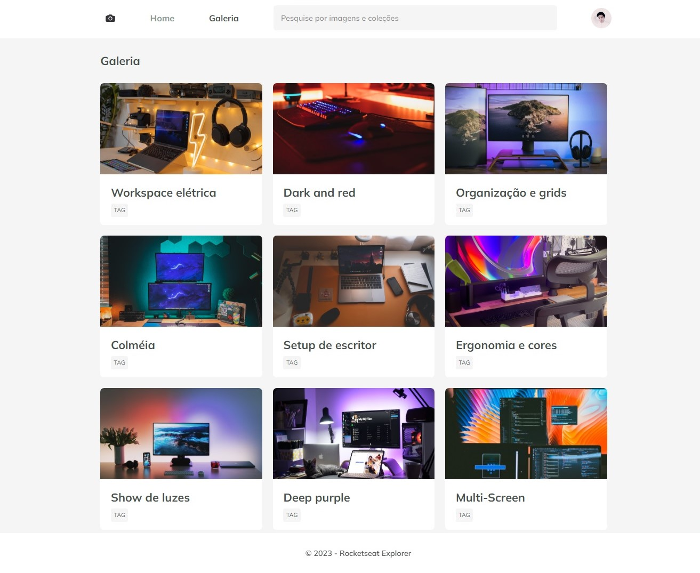

<h1 align="center"> Fotoblog </h1>

 

  

## 🚀 Tecnologias

Esse projeto foi desenvolvido com as seguintes tecnologias:

- HTML e CSS
- Git e Github
- Figma

## 💻 Projeto

O Fotoblog é um site com o objetivo de apresentar imagens e projetos de uma maneira semelhante a um diário visual.

- [Visite o projeto online](https://jonatanfiuza.github.io/fotoblog)

## 🛠️ Ferramentas

- Animations
- Transitions
- Grid
- Filter
- Aspect-ratio
- Variáveis CSS
